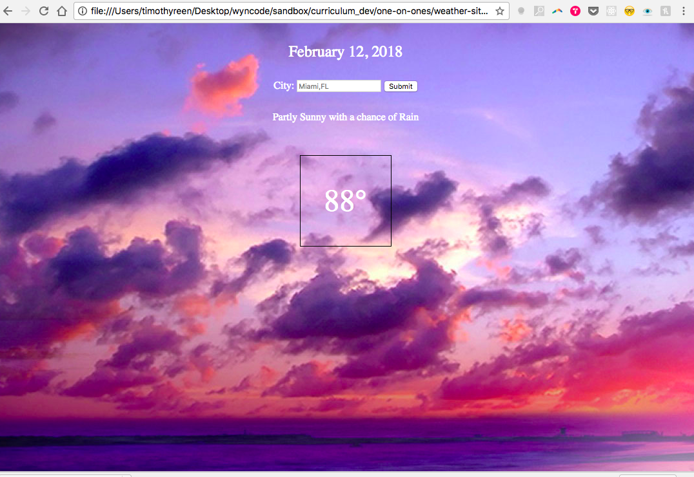

# HTML & CSS Coding Challenge

## Big Picture

Write enough HTML and CSS to get a browser to render the following content.

## Instructions

### Git

* Clone this repo and cd into it.
* Create an issue called "Create Weather Page" and assign it to yourself.  Assign it a label of "enhancement"
* Checkout a branch for your work with the naming convention `enhancement-(issue-number)-(issue-description)`

### HTML

* Write your code in the `index.html` file.
* Add a Page title
* Put today's date in an h1 tag.
* Make a form element (you can leave the form `action` set to `#`)
* Make a text input with a label that represents the city the user wants the weather for.   (Give the input a placeholder value of "Miami").
* Make a button to submit the form.  When the form submits, the url should change to say `?city=Miami` at the end (Or whatever the user currently has typed into the input).
* Place the date, temperature, and description of the weather each in its own div (_We don't need the page to be accurate. Just make up values_).

### CSS

* Create a css stylesheet and link it in the head of your HTML document.
* Make one of the three images in the `/images` folder the background of the body.  Use a class to accomplish this, so that if the weather changes, we could change the image by changing the class attribute of the body element.
* Center all text
* Color all the text white
* Make the temperature much larger than the rest of the text
* Add a solid black border to the temperature div.
* Give the temperature div a fixed width and center it (like in the image above).
* Add additional space above and below the temperature
* Use a [sans-serif](https://en.wikipedia.org/wiki/Sans-serif) font for all text
* Apply a media query to change the color of the temperature text when a user is viewing the site on a mobile device.

## Submitting

* Commit your work
* Push your branch up to GitHub
* Submit a pull request that will autoclose your issue
